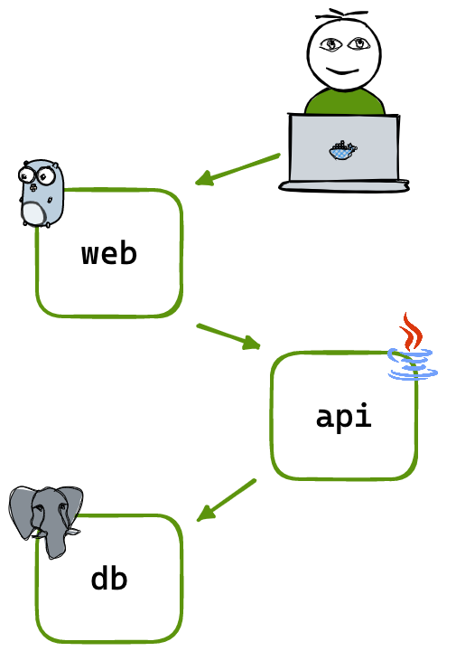

# Sample App

Sample App was originally cloned from https://github.com/dockersamples/wordsmith, and is the demo project shown at DockerCon EU 2017 and 2018.

The demo app runs across three containers:

- **[api](api/Dockerfile)** - a Java REST API which serves words read from the database
- **[web](web/Dockerfile)** - a Go web application that calls the API and builds words into sentences
- **db** - a Postgres database that stores words


## Architecture




## Build and run in Docker Compose

The only requirement to build and run the app from source is Docker. Clone this repo and use Docker Compose to build all the images. You can use the new V2 Compose with `docker compose` or the classic `docker-compose` CLI:

```shell
docker compose up --build
```

Or you can pull pre-built images from Docker Hub using `docker compose pull`.


## Deploy using Kubernetes manifests

You can deploy the same app to Kubernetes using the [Kustomize configuration](./kustomization.yaml). It will define all of the necessary Deployment and Service objects and a ConfigMap to provide the database schema.

Apply the manifest using `kubectl` while at the root of the project:

```shell
kubectl apply -k .
```

Once the pods are running, browse to http://192.168.1.171:8080 and you will see the site.

Docker Desktop includes Kubernetes and the [kubectl](https://kubernetes.io/docs/reference/kubectl/overview/) command line, so you can work directly with the cluster. Check the services are up, and you should see output like this:

```text
kubectl get svc -n sample-app
NAME   TYPE           CLUSTER-IP      EXTERNAL-IP     PORT(S)          AGE
api    ClusterIP      None            <none>          8080/TCP         3h52m
db     ClusterIP      None            <none>          5432/TCP         3h52m
web    LoadBalancer   10.110.106.63   192.168.1.171   8080:32046/TCP   3h52m
```

Check the pods are running and you should see one pod each for the database and web components and five pods for the words API:

```text
kubectl get pods -n sample-app
NAME                   READY   STATUS    RESTARTS   AGE
api-5d9b89d68c-2smnr   1/1     Running   0          3h52m
api-5d9b89d68c-gv8pj   1/1     Running   0          3h52m
api-5d9b89d68c-kc758   1/1     Running   0          3h52m
api-5d9b89d68c-mnrkq   1/1     Running   0          3h52m
api-5d9b89d68c-ts8x7   1/1     Running   0          3h52m
db-67c5774bd9-scrwf    1/1     Running   0          3h52m
web-767ff95bf5-ljmg2   1/1     Running   0          3h52m
```


# Prerequisites for the Azure DevOps Pipelines

**In Azure DevOps:**
- Service connection `docker-svc-conn` in Azure DevOps -> Sample App -> Project settings -> Pipelines -> Service connection.
- Service connection `kubernetes-svc-conn` in Azure DevOps -> Sample App -> Project settings -> Pipelines -> Service connection.

  **NOTE IMPORTANT!:** Every time the namespace `sample-app` is deleted is necessary to recreate the Azure DevOps Service connection again, otherwise, the pipeline job won't be finish correctly.

**In Kubernetes:**
- Secret `regcred` in Kubernetes for the Docker Hub push.
- Secret `azure-devops-svc-secret` in Kubernetes for the Kubernetes Service Connection deployment.
- Install/Configure [MetalLB](https://metallb.universe.tf/installation/) to expose the services with the External IP 192.168.1.171.
- Apply the following code snippet to create the IP Address Pool:

```shell
kubectl apply -f - <<EOF
apiVersion: metallb.io/v1beta1
kind: IPAddressPool
metadata:
  name: lab-ip-pool
  namespace: metallb-system
spec:
  addresses:
  - 192.168.1.0/24
  avoidBuggyIPs: true
  serviceAllocation:
    priority: 50
    namespaces:
      - sample-app
      - other-namespace
---
apiVersion: metallb.io/v1beta1
kind: L2Advertisement
metadata:
  name: empty
  namespace: metallb-system
EOF
```
